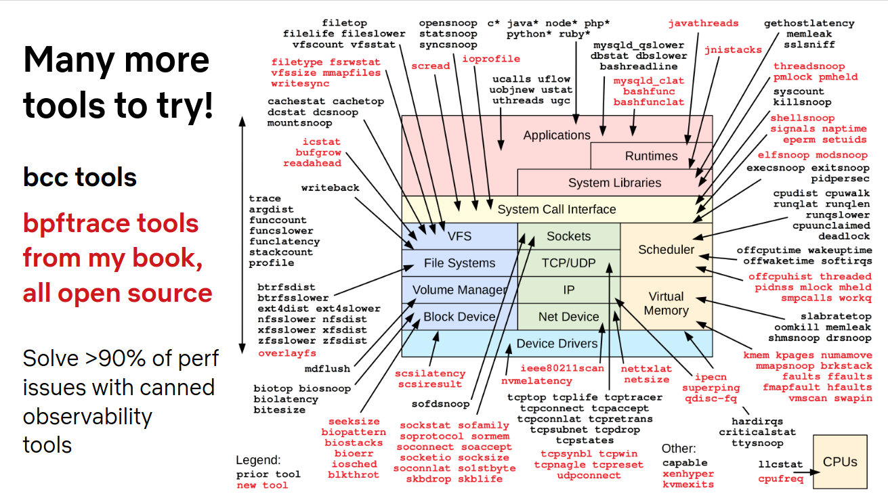

# 1.1 BPF和eBPF是什么
BPF：Berkeley Packet Filter。诞生与1992年，用于提升网络包过滤工具的性能。2013年，Alexei Starovoitov向Linux社区提交了重新实现BPF的内核补丁。BPF变成了一个通用的执行引擎。BPF提供了一种在各种内核事件和应用程序事件发生时运行一小段程序的机制。该技术将内核变的完全可编程，允许用户定制和控制他们的系统，以解决现实问题。

BPF是一项灵活而高效的技术，由指令集、存储对象和辅助函数等几部分组成。虚拟指令由内核的BPF运行时模块执行，运行时模块提供两种执行机制，一个解释器和一个将BPF指令动态转换为本地化指令的即时（JIT）编译器。在实际执行前，BPF指令必须通过验证器（verifer）的安全检查。

# 1.2 跟踪、嗅探、剖析和可观测性
* 跟踪（tracing）

基于事件的记录

* 采样（sampling）

通过获得全部观测量的子集来描绘目标的大致图像。也被称为生成性能剖析样本或profiling。bpf工具profile，linux工具perf，基于定时器来对运行的代码实时采样。特点是，其性能开销比跟踪工具小。

* 可观测性

是指通过全面的观测来理解一个系统，可实现这一目标的工具就是可观测工具。包括跟踪工具、采样工具和基于固定计数器的工具。但不包含基准测试工量（benchmark）工具，基准测量工具在系统上模拟业务负载，会改变系统的状态。

# 1.3 bcc、bpftrace和IO Visor

BCC bpf编译器集合BPF Compiler Collection是最早用于开发BPF程序的高级框架。提供C、python、lua和C++环境的用户端接口。是libbcc和libbpf的前身，这两个库提供了使用BPF程序对事件进行观测的库函数。BCC源代码库提供了70多个BPF工具。

bpftrace是一个新出现的前端。提供了BPF工具的高级语言支持。它也是基于libbcc和libbpf库来实现功能的。

bpftrace适合编写功能强大的单行程序、短小的脚本。BCC则更适合开发复杂的脚本和作为后台进程使用。BCC和bpftrace不在内核代码仓库中，而是属于一个名为IO Visor的linux基金会项目。

# 1.4 初始BCC，快速上手

```bash
# execsnoop
PCOMM            PID    PPID   RET ARGS
sleep            206995 58644    0 /usr/bin/sleep 1
ls               206996 58644    0 /usr/bin/ls --color=auto
ls               206997 58644    0 /usr/bin/ls --color=auto
goroutines       206998 58644    0 ./goroutines
sudo             207011 58644    0 /usr/bin/sudo execsnoop-bpfcc
execsnoop-bpfcc  207012 207011   0 /usr/sbin/execsnoop-bpfcc

# execsnoop -t
```

io延迟信息 biolatency-bpfcc -m

# 1.5 bpf跟踪的能见度



# 1.6 动态插桩：kprobe和uprobe

bpftrace -l

# 1.7 静态插桩：tracepoint和USDT

# 1.8 初始bpftrace 跟踪open()

```cosole
# bpftrace -l 'tracepoint:syscalls:sys_enter_open*'
# bpftrace -e 'tracepoint:syscalls:sys_enter_openat { printf("%s %s \n",comm,str(args->filename));}'

# bpftrace -e 'tracepoint:syscalls:sys_enter_open* { @[probe] = count();}'
# opensnoop.bt
```

# 1.9 在回到BCC：跟踪open
```bash
# opensnoop-bpfcc
# opensnoop-bpfcc -h
# opensnoop-bpfcc -x
```